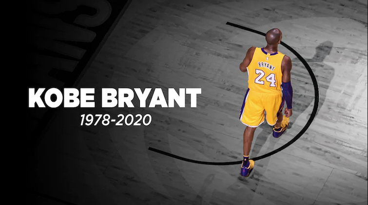

# Go Solution for LeetCode (Weekly Contest 173 Updated)

Update at least one problem each day from [Daily Problems](https://docs.google.com/spreadsheets/d/1kBGyRsSdbGDu7DzjQcC-UkZjZERdrP8-_QyVGXHSrB8/edit#gid=0).

Please see our [Wechat Group](https://wisdompeak.github.io/lc-score-board/rules.html) if you are interested in daily problems and LeetCode Weekly Contest.

  

In honor of Kobe - Jan 26th, 2020

 No. | Name | Type |
--- | --- | ---
1335 | [Minimum Difficulty of a Job Schedule][1335] *| DP
1334 | [Find the City With the Smallest Number of Neighbors at a Threshold Distance][1334] *| DP, Floyd-Warshall
1320 | [Minimum Distance to Type a Word Using Two Fingers][1320] *| DP
1312 | [Minimum Insertion Steps to Make a String Palindrome][1312] *| DP
1301 | [Number of Paths with Max Score][1301] | DP
1278 | [Palindrome Partitioning III][1278] *| DP
1223 | [Dice Roll Simulation][1223] *| DP
132 | [Palindrome Partitioning II][132] | DP
1066 | [Campus Bikes II][1066] *| DP
1057 | [Campus Bikes ][1057] | Priority Queue 
973 | [K Closest Points to Origin][973] | Priority Queue
215 | [Kth Largest Element in an Array][215] | Priority Queue
1224 | [Maximum Equal Frequency][1224] *| Hashtable
1218 | [Longest Arithmetic Subsequence of Given Difference][1218] | Hashtable
1153 | [String Transforms Into Another String][1153] *| Hashtable
523 | [Continuous Subarray Sum][523] | Hashtable
149 | [Max Points on a Line][149] *| Hashtable
1291 | [Sequential Digits][1291] | Math
1262 | [Greatest Sum Divisible by Three][1262] | Math
1238 | [Circular Permutation in Binary Representation][1238] | Math
1175 | [Prime Arrangements][1175] | Math
1103 | [Distribute Candies to People][1103] | Math
1093 | [Statistics from a Large Sample][1093] | Math
1040 | [Moving Stones Until Consecutive II][1040] | Math
1033 | [Moving Stones Until Consecutive][1033] | Math
1017 | [Convert to Base -2][1017] *| Math
1015 | [Smallest Integer Divisible by K][1015] *| Math
1073 | [Adding Two Negabinary Numbers][1073] *| Math
991 | [Broken Calculator][991] | Math
984 | [String Without AAA or BBB][984] *| Math, Greedy
972 | [Equal Rational Numbers][972] | Math
964 | [Least Operators to Express Number][964] * | Math, DFS, Memo
949 | [Largest Time for Given Digits][949] | Math
1250 | [Check If It Is a Good Array][1250] | Math, GCD
914 | [X of a Kind in a Deck of Cards][914] | Math, GCD
906 | [Super Palindromes][906] | Math, strconv
902 | [Numbers At Most N Given Digit Set][902] | Math
891 | [Sum of Subsequence Widths][891] | Math, MOD
869 | [Reordered Power of 2][869] *| Math
858 | [Mirror Reflection][858] *| Math
836 | [Rectangle Overlap][836] | Math
829 | [Consecutive Numbers Sum][829] *| Math
789 | [Escape The Ghosts][789] | Math
780 | [Reaching Points][780] | Math
775 | [Global and Local Inversions][775] | Math
754 | [Reach a Number][754] | Math
670 | [Maximum Swap][670] | Math
593 | [Valid Square][593] | Math
517 | [Super Washing Machines][517] *| Math
458 | [Poor Pigs][458] *| Math
400 | [Nth Digit][400] | Math
396 | [Rotate Function][396] | Math
365 | [Water and Jug Problem][365] | Math
335 | [Self Crossing][335] | Math
233 | [Number of Digit One][233] | Math
223 | [Rectangle Area][223] | Math
202 | [Happy Number][202] | Math
166 | [Fraction to Recurring Decimal][166] | Math
89 | [Gray Code][89] *| Math
67 | [Add Binary][67] *| Math
60 | [Permutation Sequence][60] | Math
1086 | [High Five][1086] | Comparator
1310 | [XOR Queries of a Subarray][1310] | Bit Manipulation (XOR)
1009 | [Complement of Base 10 Integer][1009] | Bit Manipulation
1318 | [Minimum Flips to Make a OR b Equal to c][1318] | Bit Manipulation
810 | [Chalkboard XOR Game][810] | Bit Manipulation (XOR), Math
1311 | [Get Watched Videos by Your Friends][1311] | BFS, Comparator
1298 | [Maximum Candies You Can Get from Boxes][1298] | BFS
1293 | [Shortest Path in a Grid with Obstacles Elimination][1293] | BFS
1284 | [Minimum Number of Flips to Convert Binary Matrix to Zero Matrix][1284] | BFS
1263 | [Minimum Moves to Move a Box to Their Target Loacation][1263] *| BFS 
994 | [Rotting Oranges][994] | BFS
913 | [Cat and Mouses][913] *| BFS
864 | [Shortest Path to Get All Keys][864] *| BFS
847 | [Shortest Path Visiting All Nodes][847] *| BFS
130 | [Surrounded Regions][130] | BFS
127 | [Word Ladder][127] | BFS
126 | [Word Ladder II][126] *| BFS
1292| [Maximum Side Length of a Square with Sum Less than or Equal to Threshold][1292] | Binary Search
744 | [Find Smallest Letter Greater Than Target][744] | Binary Search
287 | [Find the Duplicate Number][287] | Binary Search By Value
1300 | [Sum of Mutated Array Closest to Target][1300] *| Binary Search By Value
483 | [Smallest Good Base][483] *| Binary Search By Value, Bit Manipulation, Math
40 | [Permutations II][40] | BackTrack
753 | [Cracking the Safe][753] *| BackTrack
131 | [Palindrome Partitioning][131] | BackTrack
1307 | [Verbal Arithmetic Puzzle][1307] *| BackTrack
369 | [Plus One Linked List][369] | Linked List
206 | [Reverse LinkedList][206] | Linked List
23 | [Merge K Sorted Lists][23] | Linked List
1326 | [Minimum Number of Taps to Open to Water a Garden][1326] | Greedy
1024 | [Video Stitching][1024] | Greedy
927 | [Three Equal Parts][927] | Greedy
861 | [Score After Flipping Matrix][861] | Greedy
1329 | [Sort the Matrix Diagonally][1329] | Array
1253 | [Reconstruct a 2-Row Binary Matrix][1253] | Array
1314 | [Matrix Block Sum][1314] | Array
1021 | [Remove Outermost Parentheses][1021] | Array
910 | [Smallest Range II][910] | Array
1328 | [Break a Palindrome][1328] | String
678 | [Valid Parenthesis String][678] | String
189 | [Rotate Array][189] | Array
1297 | [Maximum Number of Occurrences of a Substring][1297] | Sliding Window
1151 | [Minimum Swaps to Group All 1's Together][1151] | Sliding Window
1031 | [Maximum Sum of Two Non-Overlapping Subarrays][1031] *| Sliding Window
1325 | [Delete Leaves With a Given Value][1325] | Binary Tree
1315 | [Sum of Nodes with Even-Valued Grandparent][1315] *| Binary Tree
1319 | [Number of Operations to Make Network Connected][1319] | Union Find

[1298]: ./Problems/1298.%20Maximum%20Candies%20You%20Can%20Get%20from%20Boxes/
[1293]: ./Problems/1293.%20Shortest%20Path%20in%20a%20Grid%20with%20Obstacles%20Elimination/
[1292]: ./Problems/1292.%20Maximum%20Side%20Length%20of%20a%20Square%20with%20Sum%20Less%20than%20or%20Equal%20to%20Threshold/
[1291]: ./Problems/1291.%20Sequential%20Digits/
[1284]: ./Problems/1284.%20Minimum%20Number%20of%20Flips%20to%20Convert%20Binary%20Matrix%20to%20Zero%20Matrix/
[1278]: ./Problems/1278.%20Palindrome%20Partitioning%20III/
[1263]: ./Problems/1263.%20Minimum%20Moves%20to%20Move%20a%20Box%20to%20Their%20Target%20Location/
[1218]: ./Problems/1218.%20Longest%20Arithmetic%20Subsequence%20of%20Given%20Difference/
[149]: ./Problems/149.%20Max%20Points%20on%20a%20Line/
[1175]: ./Problems/1175.%20Prime%20Arrangements/
[1103]: ./Problems/1103.%20Distribute%20Candies%20to%20People/
[1066]: ./Problems/1066.%20Campus%20Bikes%20II/
[1057]: ./Problems/1057.%20Campus%20Bikes/
[1093]: ./Problems/1093.%20Statistics%20from%20a%20Large%20Sample/
[1040]: ./Problems/1040.%20Moving%20Stones%20Until%20Consecutive%20II/
[1033]: ./Problems/1033.%20Moving%20Stones%20Until%20Consecutive/
[1009]: ./Problems/1009.%20Complement%20of%20Base%2010%20Integer/
[1086]: ./Problems/1086.%20High%20Five/
[994]: ./Problems/994.%20Rotting%20Oranges/
[913]: ./Problems/913.%20Cat%20and%20Mouse/
[858]: ./Problems/858.%20Mirror%20Reflection/
[864]: ./Problems/864.%20Shortest%20Path%20to%20Get%20All%20Keys/
[847]: ./Problems/847.%20Shortest%20Path%20Visiting%20All%20Nodes/
[780]: ./Problems/780.%20Reaching%20Points/
[744]: ./Problems/744.%20Find%20Smallest%20Letter%20Greater%20Than%20Target/
[670]: ./Problems/670.%20Maximum%20Swap/
[130]: ./Problems/130.%20Surrounded%20Regions/
[127]: ./Problems/127.%20Word%20Ladder/
[126]: ./Problems/126.%20Word%20Ladder%20II/
[369]: ./Problems/369.%20Plus%20One%20Linked%20List/
[365]: ./Problems/365.%20Water%20and%20Jug%20Problem/
[335]: ./Problems/335.%20Self%20Crossing/
[287]: ./Problems/287.%20Find%20the%20Duplicate%20Number/
[233]: ./Problems/233.%20Number%20of%20Digit%20One/
[206]: ./Problems/206.%20Reverse%20Linked%20List/
[202]: ./Problems/202.%20Happy%20Number/
[166]: ./Problems/166.%20Fraction%20to%20Recurring%20Decimal/
[131]: ./Problems/131.%20Palindrome%20Partitioning/
[132]: ./Problems/132.%20Palindrome%20Partitioning%20II/
[23]: ./Problems/23.%20Merge%20k%20Sorted%20Lists/
[972]: ./Problems/972.%20Equal%20Rational%20Numbers/
[1017]: ./Problems/1017.%20Convert%20to%20Base%20-2/
[1073]: ./Problems/1073.%20Adding%20Two%20Negabinary%20Numbers/
[89]: ./Problems/89.%20Gray%20Code/
[189]: ./Problems/189.%20Rotate%20Array/
[1238]: ./Problems/1238.%20Circular%20Permutation%20in%20Binary%20Representation/
[991]: ./Problems/991.%20Broken%20Calculator/
[1300]: ./Problems/1300.%20Sum%20of%20Mutated%20Array%20Closest%20to%20Target/
[984]: ./Problems/984.%20String%20Without%20AAA%20or%20BBB/
[1015]: ./Problems/1015.%20Smallest%20Integer%20Divisible%20by%20K/
[1297]: ./Problems/1297.%20Maximum%20Number%20of%20Occurrences%20of%20a%20Substring/
[1301]: ./Problems/1301.%20Number%20of%20Paths%20with%20Max%20Score/
[1151]: ./Problems/1151.%20Minimum%20Swaps%20to%20Group%20All%201's%20Together/
[949]: ./Problems/949.%20Largest%20Time%20for%20Given%20Digits/
[1153]: ./Problems/1153.%20String%20Transforms%20Into%20Another%20String/
[67]: ./Problems/67.%20Add%20Binary/
[927]: ./Problems/927.%20Three%20Equal%20Parts/
[914]: ./Problems/914.%20X%20of%20a%20Kind%20in%20a%20Deck%20of%20Cards/
[1250]: ./Problems/1250.%20Check%20If%20It%20Is%20a%20Good%20Array/
[1262]: ./Problems/1262.%20Greatest%20Sum%20Divisible%20by%20Three/
[458]: ./Problems/458.%20Poor%20Pigs/
[910]: ./Problems/910.%20Smallest%20Range%20II/
[1311]: ./Problems/1311.%20Get%20Watched%20Videos%20by%20Your%20Friends/
[1312]: ./Problems/1312.%20Minimum%20Insertion%20Steps%20to%20Make%20a%20String%20Palindrome/
[1310]: ./Problems/1310.%20XOR%20Queries%20of%20a%20Subarray/
[754]: ./Problems/754.%20Reach%20a%20Number/
[964]: ./Problems/964.%20Least%20Operators%20to%20Express%20Number/
[906]: ./Problems/906.%20Super%20Palindromes/
[902]: ./Problems/902.%20Numbers%20At%20Most%20N%20Given%20Digit%20Set/
[861]: ./Problems/861.%20Score%20After%20Flipping%20Matrix/
[891]: ./Problems/891.%20Sum%20of%20Subsequence%20Widths/
[215]: ./Problems/215.%20Kth%20Largest%20Element%20in%20an%20Array/
[973]: ./Problems/973.%20K%20Closest%20Points%20to%20Origin/
[869]: ./Problems/869.%20Reordered%20Power%20of%202/
[836]: ./Problems/836.%20Rectangle%20Overlap/
[223]: ./Problems/223.%20Rectangle%20Area/
[1318]: ./Problems/1318.%20Minimum%20Flips%20to%20Make%20a%20OR%20b%20Equal%20to%20c/
[1319]: ./Problems/1319.%20Number%20of%20Operations%20to%20Make%20Network%20Connected/
[1320]: ./Problems/1320.%20Minimum%20Distance%20to%20Type%20a%20Word%20Using%20Two%20Fingers/
[829]: ./Problems/829.%20Consecutive%20Numbers%20Sum/
[1307]: ./Problems/1307.%20Verbal%20Arithmetic%20Puzzle/
[810]: ./Problems/810.%20Chalkboard%20XOR%20Game/
[789]: ./Problems/789.%20Escape%20The%20Ghosts/
[775]: ./Problems/775.%20Global%20and%20Local%20Inversions/
[753]: ./Problems/753.%20Cracking%20the%20Safe/
[593]: ./Problems/593.%20Valid%20Square/
[1021]: ./Problems/1021.%20Remove%20Outermost%20Parentheses/
[1314]: ./Problems/1314.%20Matrix%20Block%20Sum/
[1315]: ./Problems/1315.%20Sum%20of%20Nodes%20with%20Even-Valued%20Grandparent/
[1326]: ./Problems/1326.%20Minimum%20Number%20of%20Taps%20to%20Open%20to%20Water%20a%20Garden/
[1325]: ./Problems/1325.%20Delete%20Leaves%20With%20a%20Given%20Value/
[1024]: ./Problems/1024.%20Video%20Stitching/
[1253]: ./Problems/1253.%20Reconstruct%20a%202-Row%20Binary%20Matrix/
[523]: ./Problems/523.%20Continuous%20Subarray%20Sum/
[1224]: ./Problems/1224.%20Maximum%20Equal%20Frequency/
[1031]: ./Problems/1031.%20Maximum%20Sum%20of%20Two%20Non-Overlapping%20Subarrays/
[1223]: ./Problems/1223.%20Dice%20Roll%20Simulation/
[517]: ./Problems/517.%20Super%20Washing%20Machines/
[483]: ./Problems/483.%20Smallest%20Good%20Base/
[400]: ./Problems/400.%20Nth%20Digit/
[396]: ./Problems/396.%20Rotate%20Function/
[60]: ./Problems/60.%20Permutation%20Sequence/
[1335]: ./Problems/1335.%20Minimum%20Difficulty%20of%20a%20Job%20Schedule/
[40]: ./Problems/400.%20Nth%20Digit/
[1334]: ./Problems/1334.%20Find%20the%20City%20With%20the%20Smallest%20Number%20of%20Neighbors%20at%20a%20Threshold%20Distance/
[678]: ./Problems/678.%20Valid%20Parenthesis%20String/
[1328]: ./Problems/1328.%20Break%20a%20Palindrome/
[1329]: ./Problems/1329.%20Sort%20the%20Matrix%20Diagonally/

* Nice Question